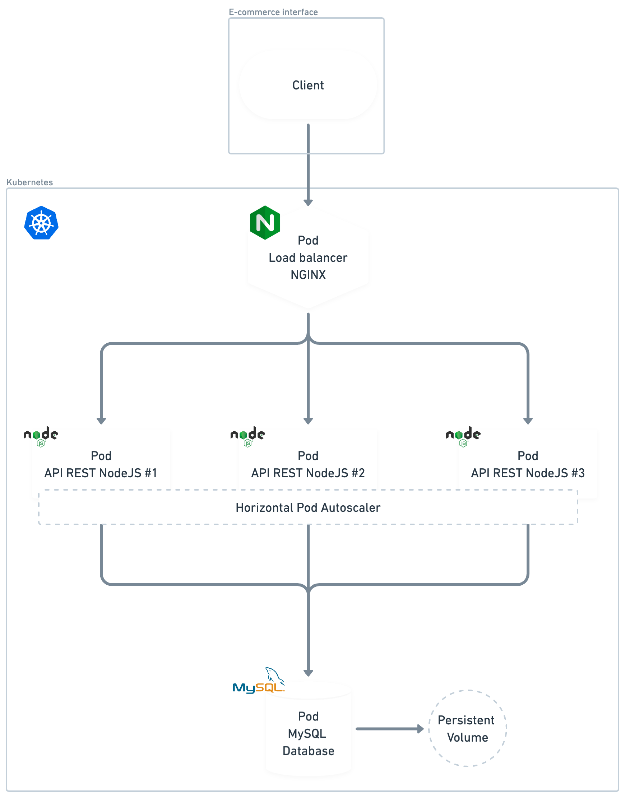

 <br> <br>

1. Using `kubectl`, execute the mysql database pod secret creation configuration on "mysql-secret.yml" file;
    ```bash
        kubectl apply -f mysql-secret.yml
    ```

2. Create an volume for the database pod, by that, the database keeps/persists its data when it gets dropped. To create this, we're going to use the K8S PersistentVolumeClaim API;
    ```bash
        kubectl apply -f mysql-persistent-volume-claim.yml
    ```

3. Apply the K8S Deployment of the MySQL database, which will be consumed by the main application;
    ```bash
        kubectl apply -f mysql-deployment.yml
    ```

4. Create an service for the database pod, it will gives to it and external access point to be consumed by our main application;
    ```bash
        kubectl apply -f mysql-service.yml
    ```

5. Create an ConfigMap for the main application, in resume it stores all necessary configs for the application in an flexible way using the K8S ConfigMap API;
    ```bash
        kubectl apply -f app-config.yml
    ```

6. Apply the Deployment of the main application;
    ```bash
        kubectl apply -f app-deployment.yml
    ```
7. Apply the main application horizontal pod autoscaler;
    ```bash
        kubectl apply -f app-hpa.yml
    ```
8. Apply the creation of the NGINX ConfigMap, Deployment and Service LoadBalancer
    ```bash
        kubectl apply -f nginx-deployment.yml
    ``` 

> ⚠️ Warning <br>
> In case of errors when applying the MySQL Deployment such as `Fatal error: Can't open and lock privilege tables: Table 'mysql.user' doesn't exist` <br>
> Recreate the Minikube container using the ```minikube delete``` and ```minikube start``` commands.


#### Steps to reflect the changes/modification made in the main application source doe to the K8S Pod container

1. Save the modified files;
2. Build the image with the new modifications;
    ```bash
        `docker build -t <image_name>:<new_tag> <dockerfile_path>
    ```
3. Create an Docker tag (if not existent yet)
    ```bash
        `docker tag <image_name>:<new_tag> <docker_hub_username>/<image_name>:<new_tag>
    ```

4. Push the generated image to Docker Hub
    ```bash
        `docker push <docker_hub_username>/<image_name>:<new_tag>
    ```

By these steps, if the main application deployment yaml file keeps referencing this image with the same tag (latest), the changes should be applied to the Pod on Pod restart.


> Steps to access the application database in the MySQL CLI on its respective K8S Pod (If necessary) <br>
> 1. Access the MySQL Pod terminal <br>
>    ```bash
>        kubectl exec -it <pod_name> /bin/bash 
>    ```
> 2. Execute the MySQL CLI passing these respective params: <br>
>    ```bash
>        mysql --host <mysql_service_name> -u<db_user> -p<db_password>
>        
>        #Example
>        mysql --host mysql-service -uroot -pdb123 # Docker treats the host name as an DNS address pointing to an IP
>    ```

> 🗣️ Tip
> 1. In case of Prisma binaries not implemented yet, run: <br>
> ```bash
>    npx prisma generate
> ```
> 2. To apply the declared seeds to the database, run: <br>
> ```bash
>    npx prisma db seed
> ```

> Command to make an stress test on the API endpoint:
    ```bash
        while true; do wget -q -O- <api_url>;done;
    ```
<br>

## 📜 [API routes documentation](https://documenter.getpostman.com/view/23113709/2s93Xwz4QD)